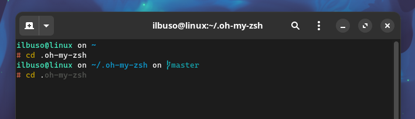

# buso-OhMyZsh-theme  - by ilBuso

## Table of Content
- [buso-OhMyZsh-theme](#buso-ohmyzsh-theme---by-ilbuso)
    - [Table of Content](#table-of-content)
    - [About](#about)
    - [Screenshots](#screenshots)
    - [Usage](#usage)
        - [Prerequisite](#prerequisite)
        - [Installation](#installation)          
    - [Configuration .zshrc](#configuration-zshrc)

## About
The "buso" theme is a minimalistic [OhMyZsh](https://ohmyz.sh/) theme I've created, featuring a bare-bones design that prioritizes essential information. Drawing inspiration from the [amro](https://ohmyposh.dev/docs/themes#amro) theme of [OhMyPosh](https://ohmyposh.dev/), "buso" provides a clean and efficient command-line interface without any distractions. While it doesn't have many features, its simplicity enhances the user experience.

## Screenshots


## Usage
## Prerequisite
To use this theme, ensure the following prerequisites are met:

- OhMyZsh Installed: Make sure OhMyZsh is already installed on your system.
- Zsh as Default Shell: Set Zsh as your default shell in the terminal.
- [Nerd Font](https://www.nerdfonts.com/) (or similar) Installed: Install a Nerd Font of your choice (necessary for UNICODE characters)

### Installation
To install the `buso` theme, run the following command:
```Bash
git clone https://github.com/ilBuso/ohmyzsh-theme.git ${ZSH_CUSTOM:-~/.oh-my-zsh/custom}/themes
```
To set `buso.zsh-theme` as the default theme in the `.zshrc` file, add:
```Bash
ZSH_THEME="buso"
```

## Configuration .zshrc
This is my persona configuration of the `.zshrc` file, feel free to copy it and customize these configurations based on your preferences.

`zsh-autosuggestions`and `zsh-syntax-highlighting` are not avvailable by default they must be installed ( [autosuggestions](https://github.com/zsh-users/zsh-autosuggestions/blob/master/INSTALL.md#oh-my-zsh) ) ( [syntax-highlighting](https://github.com/zsh-users/zsh-syntax-highlighting/blob/master/INSTALL.md#oh-my-zsh) )

```Bash
# Path to your oh-my-zsh installation.
export ZSH="$HOME/.oh-my-zsh"

#theme
ZSH_THEME="buso"

# used pugins
plugins=(
    # git
    git

    # auto-suggestions based on previous command
    zsh-autosuggestions

    # highlight the first word of the command
    # changed default color to yellow on file
    # (~/.oh-my-zsh/custom/plugins/zsh-syntax-highlighting/highlighters/main/main-highlighter.zsh)
    # on line 65
    zsh-syntax-highlighting

    # start browser from terminal
    web-search
)

source $ZSH/oh-my-zsh.sh


# User configuration

# Remove highlight con paste (Ctrl+Shift+V)
zle_highlight+=(paste:none) 

# Remove the underline in the path
ZSH_HIGHLIGHT_STYLES[path]=none
```
